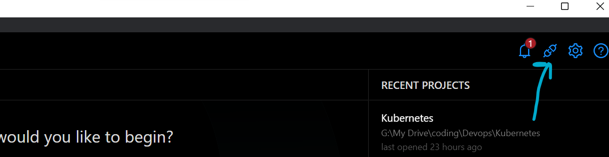
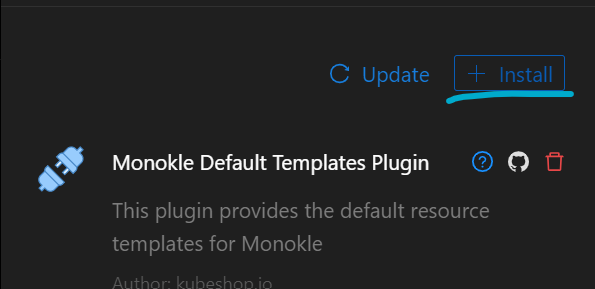
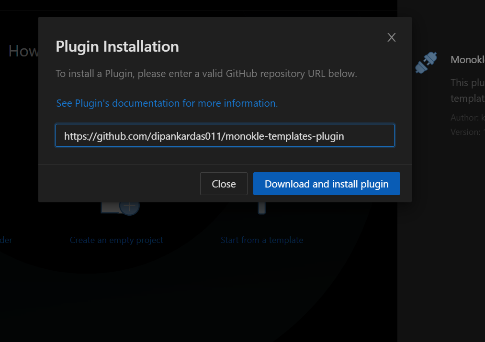
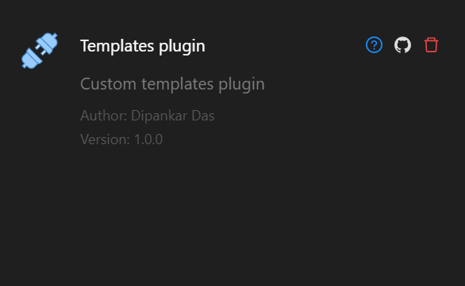

# This the Monokle template Repo

* ✅ **Init-Container-template**
* ✅ **Nginx-pod-template**

are the 2 template that you can use

# Installation
1. Open the Monokle and click the plugin icon 

2. Then click Install

3. Enter the github URL

4. Got installed
